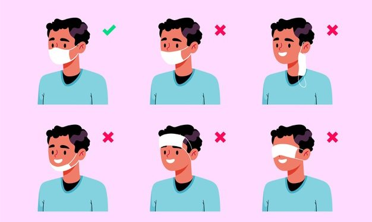
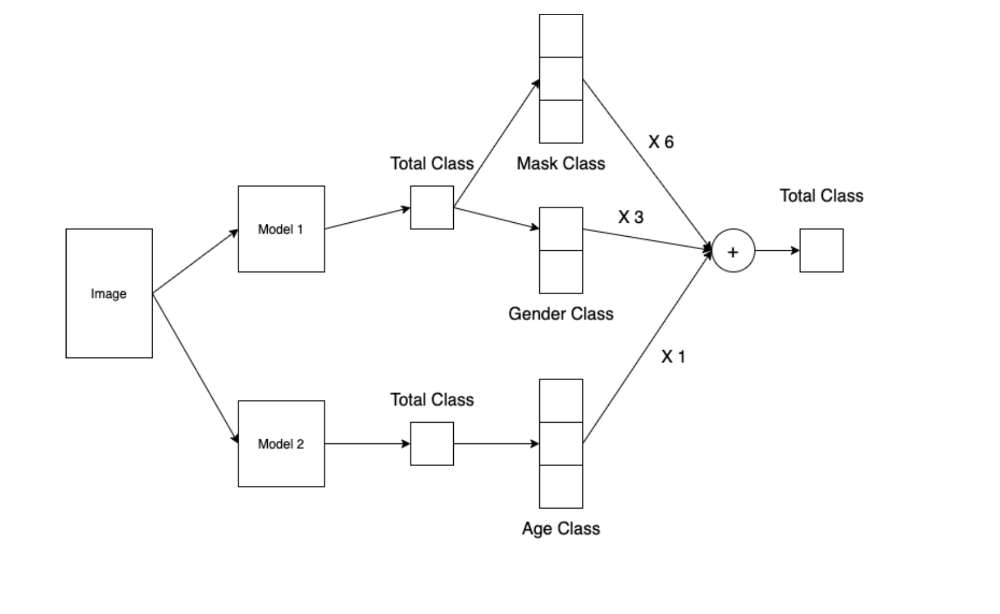

# Wrap Up Report
RecSys 12 - 12걸지말조  

## 1. 대회 개요 및 데이터 소개

- COVID-19의 확산으로 전 세계는 많은 활동에 제약을 받게 되었습니다. 과거에 높은 사망률을 가졌던 사스(SARS)나 에볼라(Ebola)와 달리 COVID-19은 전염성이 강한 질병으로 알려져있습니다. COVID-19의 주요 전염경로는 비말, 침 등에 의한 비말감염입니다. WHO를 비롯한 전 세계에서 마스크 착용을 강력히 권고하고 있으며 가장 강조하고 있는 것은 입과 코를 정확하게 가린 올바른 마스크 착용입니다. 이런 이유로 공공장소에서 마스크를 착용여부를 확인하고 있지만 이 과정에서 추가적인 인적자원이 필요할 것입니다. 이를 해결하고자 공공장소 입구에서 활용할 올바른 마스크 착용여부를 확인할 수 있는 시스템을 구축하기 위해 모델을 학습하는 것이 대회의 목적입니다.
전체 데이터는 총 4,500명의 이미지 데이터로 구성되어 있으며 각각 5개의 올바른 마스크 착용 이미지, 1개의 마스크 미착용, 올바르지 않은 마스크 착용 이미지로 총 7장의 이미지가 있습니다. 이미지 크기는 512 X 384로 한 장당 약 0.5MB입니다. 총 31,500장의 이미지 중 60%(18,900장)가 훈련 데이터로 활용하였고 나머지 40%(12,600장)이 평가 데이터로 사용되었습니다.
클래스는 마스크 착용 여부 3종, 성별 2종, 연령대 3종으로 총 18가지(3 X 2 X 3)의 클래스로 분류됩니다.

## 2. 팀 구성 및 역할
- 팀 공통 역할 : 개인 모델 및 하이퍼파라미터로 실험 설계 및 진행 박기범 : ML 및 실험에 사용되는 코드 일반화 및 툴 개발
- 박준형 : 클래스 불균형 분석 및 처리
- 박기범 : ML 및 실험에 사용되는 코드 일반화 및 툴 개발
- 조예진 : 모델 실험 결과 분석 및 앙상블 모델 구현 진완혁 : Pre-trained 모델 최적화
- 진완혁 : Pre-trained 모델 최적화
- 이서희 : 데이터 시각화를 통한 분포 분석 및 결과 분석

## 3. 프로젝트 과정 

### 3.1 Data 처리
- a) 데이터분포변화
  - 60세이상의 클래스 비율이 7%로 부족하여 클래스 분류 범위를 59세, 58세로
넓혀서 진행
  - 59세와 60세의 생물학적 노화의 차이는 미미하다고 생각함
  - 59세까지 확장한 경우 10%, 58세까지 확장하면 16%까지 커버하였음
  - 58세까지 60세이상으로 분류하여 학습한 결과 F1 score 0.0464 향상
- b) 데이터증강
  - 단순 데이터 증강은 의미가 없다고 판단하여 이미지에 변형을 도입
  - GaussianBlur, HorizontalFlip, GridDistortion 등을 활용하여 a)에서 확인 하여 부족한 분포의 데이터를 증강
  - F1 score가 0.0401 향상이 있었음
### 3.2 모델 개요
- a) 모델1 아키텍쳐 : ResNet18
  - i) LB 점수 : 0.7000
  - ii) Dataset : ClassLabel based KFold dataset
  - iii) Training transformation
    - 1) Image Size : 512 X 384
    - 2) CenterCrop(), Normalize()
  - iv) Optimizer : AdamP
  - v) Criterion : focal loss
  - vi) Scheduler : StepLR
- b) 모델2 아키텍쳐 : ResNet18
  - i) LB 점수 : 0.7197
  - ii) Dataset : 3.1 a), b) used augmentation dataset
  - iii) Training transformation
    - 1) Image Size : 512 X 384
    - 2) CenterCrop(), Normalize()
  - iv) Optimizer : Adam
  - v) Criterion : 0.5 x focal loss + 0.5 x f1 loss
  - vi) Scheduler : CosineAnnealingLR

### 3.3 검증과정 및 앙상블

- 검증방법
  - 모델1과 2 모두 K를 5로 설정한 K-Fold CV로 검증방법 선택
- 앙상블  
  - 모델1은 마스크 상태와 성별 분류에서는 좋은 성능을 보였으나 연령 분류에서 좋지 못한 성능을 보였고 모델2는 연령 분류에서 좋은 성능을 보였음
  - 모델1에서 클래스의 역연산을 활용해 마스크 상태, 성별 분류를 추출하였고 모델2에서 역연산을 통해 연령분류를 추출하여 클래스 분류를 재연산

### 3.4 모델 평가 및 개선
- 모델결과
  - 최종 LB (f1 score) : Public 0.7603 / Private 0.7487
- 개선및논의
  - CNN 관점보다는 transformer 모델도 사용해보는 것이 더 좋았을 것으로 보임
  - Augmentation이나 transform 과정에서 배경을 더 제거하는 것이 좋았을 것으로 보임
  - 앙상블 모델 종류의 다양성을 늘렸다면 더 효과가 있을 것으로 보임
  - loss function 다양성을 늘려서 학습하면 모델이 학습하는 기준 지표가 늘어나 더 정교한 학습이 되었을 것으로 보임
## 4. 팀 자체 평가
- 칭찬할점
  - 매일 피어세션 및 슬랙을 통해 본인이 진행한 실험과 그 결과 및 고찰 등을 자세하고 솔직하게 공유하는 방식으로 성능 개선을 하였음
  - 마지막날까지 순위(47등)가 좋지 않았으나 대회 종료 직전까지 포기하지 않고 더 다양한 시도를 진행해서 순위권(10등)까지 순위를 상승하였음 
- 아쉬운점 및 배운점
  - 공통적인 템플릿을 잘 잡아두고 실험을 진행했으면 실험 간의 공유가 더 잘 되었을 것 같음
  - 데이터 셋 자체를 자주 틀리는 부분 위주로 확인하고 학습 데이터 분포를 변형하는 것이 실제 성능 향상에 더 도움이 되는 것 같음
  - 협업과 소통 자체는 잘 이루어졌으나 협업툴 을 더 정교하게 다루지못한 것이 아쉬움
